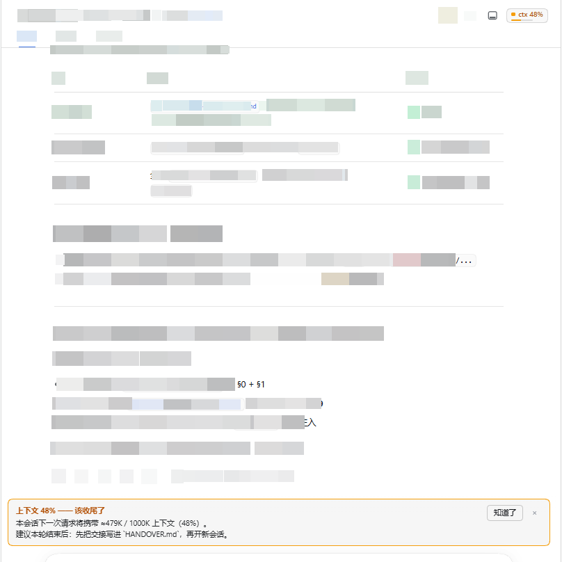

# dsh-context-guard

npm 包名：**`@2jumpsina/dsh-context-guard`**（未发布） · [English](README.md)

**会话太长就提醒你收尾换会话**的 [DeepSeek Harness](https://deepseek-harness.github.io/deepseek-harness/guide/quickstart) 插件。

消费官方 `dsh-token-meter` 已经算好的 `contextPressure` 投影，在**一轮结束之后**按双档阈值提示：
「先把交接写进文档，再开新会话」。它会顺着帮你把这句提示**变成动作** —— 跨过阈值时自动往会话工作目录起草一份交接草稿。

**上下文税 = 0**：不注册任何 model-facing 工具、不注入 prompt 段落、不额外发请求。宿主算数，UI 说话。

> ⚠️ **没有发布到 npm —— 而且 npm 上的 `dsh-context-guard` 是第三方的包。**
> `npm i dsh-context-guard` 装到的是**他们的**插件（作者 `greenlv`），不是这个。本仓库的包名是
> scoped 的：**`@2jumpsina/dsh-context-guard`**（同样没有发布）。请从本仓库安装（见[安装](#安装)）。



---

## ⚠️ 它会写你的工作目录（装之前先看这一段）

- 默认开启（`handoverOnWarn: true`）。当某个会话的**占用率跨过 `warnRatio`（默认 45%）**时，
  插件会在**该会话的工作目录**下创建/改写 `handoverPath`（默认 `HANDOVER.md`），此后水位每涨 5 个点刷新一次。
- 写入的内容是**机器事实**：会话 id、标题、工作目录、占用率、轮数/调用数、**账本花费**、
  **本次会话写过的文件清单**、**最近几轮的用户诉求与回复摘要**，以及一段留给 agent 的「待补」空槽。
  ⇒ **它可能包含敏感内容**（文件路径、你的提问与回复片段），**也可能被 git 提交**。
- 建议：把 `HANDOVER.md` 加进你的 `.gitignore`；或把 `handoverPath` 指到一个**不在仓库里**的路径；
  或直接 `handoverOnWarn: false`。
- 边界：目标父目录不存在 ⇒ 拒绝写入；目标已存在但不是文本类文件（`.json`/`.yml`/…）⇒ 拒绝改写；
  目标是指向别处的**符号链接** ⇒ 拒绝；写入使用原子替换（临时文件 + rename）并收紧权限（`0o600`）。
  任何失败都只记录状态，**绝不影响**徽标 / banner / 推送。

## 为什么需要它

**一句话**：长会话不是技术故障，而是**每一轮都在涨的账单**。这个插件存在的意义，就是在你**还能行动的那一刻**
把这张账单摆到面前 —— 一轮已经结束、下一次请求还没发出的那几秒。

### 这个问题是可测量的

成本 ≈（平均 prompt 大小）×（调用次数）×（单价）。长会话会把前两个因子**同时**推上去，而单价本身也随占用率上升。
拿**标定这台机器**自己的账本（本地 session 投影缓存，**84 个会话 / 14 天**，自报 ¥252.29）对着官方价表核：

| 测量项 | 数值 |
|---|---|
| 自检（价表 × `contextTimeline.cost`，对账本总额） | ¥254.29 vs ¥252.29 ⇒ **偏差 0.8%**；逐请求金额覆盖总额 **85.4%** |
| 单价随占用率 | 0–10% **¥0.011/次** → 70–80% **¥0.045/次（4.2×）** |
| 历史花费落在哪里 | **≥40%** 占用时的调用吃掉 **37.4%** 的花费；**≥60%** 吃掉 **20.0%** |
| 会话峰值 | **75/75 个会话都不超过 ~80%**（其中 6 个在 79–80% 处骤降）⇒ 平台自己在那一带压缩 |
| 打扰成本（线画在 40% / 50% / 60%） | 每天 **0.78 / 0.57 / 0.50** 次 |

再举一次真实会话 —— 就发生在开发这个插件的仓库里：**584 次调用、2.74 亿 token、¥31.66，其中 98.6% 花在
重读上下文，模型输出只占 0.17%。** 这正是它要对付的失败形态：不崩溃、不报错，只是一张发票。

### 为什么别的机制接不住它

- **平台会压缩，但不会跟你商量。** 观测到的会话峰值全都在 ~80% 以下，那正是 DSH 自己压缩的地方。压缩是会话的
  安全网，不是给你的通知 —— 等它触发时，你已经为整段爬升付过钱了。
- **模型自己当不了这个计量器。** `projectedTokens` 由 `dsh-token-meter` 从真实请求算出，模型看不到自己的 prompt
  有多大；而提示只有在**一轮结束之后**才有意义（那一轮的 prompt 已经发出去了）。何况任何「让模型自己注意上下文」
  的做法都要注入 prompt 段落或注册工具 —— 那等于给一个**上下文税问题**再加一笔上下文税。
- **你手上没有读数。** 占用率可以看见，但「该收尾了」不是一次读数能定的：它需要迟滞、冷却、边沿触发、跨会话计数，
  而且要在你**点进一个已经满了的历史会话**时就响。没人一边干活一边盯百分比。

### 它做了什么 —— 以及刻意不做什么

- **上下文税 = 0**：不注册 model-facing 工具、不注入 prompt 段落、不发额外请求。防上下文膨胀的东西，自己不能吃上下文。
- **只消费官方计量器已经算好的数字**：不重复计量、不估算、不猜。
- **每档只响一次，且只在一轮结束时**：双档 + 迟滞 + 边沿触发 + 冷却。
- **fail-closed**：没有分母就完全不判定，徽标显示 `ctx —` 而不是假装 0%。
- **把一句话变成动作**：跨过 `warnRatio` 就地起草一块机器事实草稿（会话、水位、账本花费、本会话写过的文件、
  最近几轮的诉求 / 回应预览，外加「待补」空槽）写进会话工作目录 —— 零 LLM、零额外请求。
- **外推推送是显式选择**（默认 `pushChannel: 'none'`）。提示插件没有资格在你没要求的情况下往你手机里发消息。

### 这一节**不**声称什么

- **省下的钱是反事实上界，不是承诺。** 拿本机账本重放：≥40% 占用时发生的那 2741 次调用，若都发生在 0–20%，
  可省 **¥59（23%）**；≥60% 的那批可省 **¥34（14%）**。收尾不是免费的 —— 它恰好要付一次交接的成本。
  这里只声称一件事：**把数字摆在面前时，这个决定能做得更好。**
- **阈值是标定值，不是最优解。** 0.45 / 0.60 来自那 84 个会话；它们是默认值，且每一个都可配置。
- **样本是单机、单 provider、两周。** 价格与压缩行为都会变。
- **它不判断你的任务值不值得做完。** 它只说一句：从这里继续，每轮比重新开始贵好几倍 —— 交接草稿在这里。

## 它做什么

| 半边 | 做什么 |
|---|---|
| **host**（`lib/index.js`） | 订阅 `ctx.sessionProjections.onChanged`，把 `contextPressure` 喂给纯策略；在 `turn/end` 结算一轮；持有设置；`session/created`（新建或从存储恢复）时立刻判一次；`compaction/end`、`request/header` 参与判定；注册 `GET /api/context-guard/state`；按设置把结论外推到微信；跨过阈值时**起草交接草稿** |
| **client**（`lib/client.js`，手写单文件 bundle） | 会话头**徽标**（实时占用率，只显示数字、不出声）+ 跨档时**一次性 banner**（占比 + 下一步 + 指向交接文档）；启动时从状态路由读回宿主设置（**内置默认 < 宿主真源 < 逃生阀**三层合并） |

行为要点：

- **绝不 mid-turn 提示**：那一轮已经发出去了，提示没有意义。
- **只响一次**：双档 + 迟滞（回落到 `warn − hysteresis` 才重新武装）+ 边沿触发 + 冷却 N 轮。
- **fail-closed**：没有分母（`contextWindow` 缺席）就不判定，徽标显式显示 `ctx —`，**不假装 0%**。

## 安装

> ⚠️ **本插件不在 npm 上，而且它的包名是 scoped 的。** 不带 scope 的 `dsh-context-guard` 归**第三方**所有
> （`greenlv <lgr5945@gmail.com>`；latest `0.2.1`，现已 deprecated 并改名为 `dsh-completion-guard`）。
> 敲 `npm i dsh-context-guard` 装到的是**他们的**插件，不是这个。本仓库的包名是
> `@2jumpsina/dsh-context-guard`，同样从未发布到 npm —— 请从本仓库安装。

从本仓库安装：

```bash
npm i github:2JumpSinA/dsh-context-guard
```

DSH 会按包内 `dsh.bundle.patch`（`cordis.patch.yml`）把宿主半边挂上；浏览器半边由 `dsh.client` 声明注入。

**本地开发时**（不发布、用 junction 挂进某个 profile）也常见：

```powershell
# 把仓库挂进目标 profile 的 node_modules（路径按你的环境替换）
New-Item -ItemType Junction `
  -Path   $env:DSH_HOME\profiles\<profile>\node_modules\@2jumpsina\dsh-context-guard `
  -Target <仓库路径>
```

然后在那个 profile 的 `cordis.patch.yml`（用户 patch 层）末尾加一条 `insert`：

```yaml
- insert:
    - id: context-guard
      name: '@2jumpsina/dsh-context-guard'
```

> ⚠️ 不要把这个包写进 profile 的 `dsh.profile.bundles` —— 会报 `cannot resolve profile bundle`。
> ⚠️ junction 挂载后，Node 从**真实路径**往上找 `node_modules` ⇒ 仓库里要有它自己的依赖（或让 DSH 从安装位置解析）。

## 配置项

设置页可改，全部即时生效；`config` 字段都是 volatile ⇒ 改完**不用重启**（但改**源码**要重启，见下）。

| 字段 | 默认 | 范围 | 含义 |
|---|---|---|---|
| `enabled` | `true` | bool | 总开关 |
| `locale` | `auto` | `auto`\|`zh`\|`en` | 文案语言；`auto` 由两半边各自推断（见「语言」一节） |
| `warnRatio` | `0.45` | 0.1–0.95 | 「该收尾了」的占用率（`projectedTokens / contextWindow`） |
| `hardRatio` | `0.60` | 0.1–1 | 「该换会话了」；必须 > `warnRatio` |
| `hysteresisRatio` | `0.05` | 0–0.2 | 迟滞：回落到 `warn − 此值` 以下才重新武装 |
| `cooldownTurns` | `5` | 0–100 | 跨档后静默多少轮 |
| `onResume` | `true` | bool | 进入一个已经很高的历史会话时也提示 |
| `respectCompaction` | `true` | bool | 自动压缩正在压水位时不提示换会话 |
| `crossSessionTrend` | `true` | bool | 统计窗口内几个会话撞过线，用于升级措辞 |
| `trendWindowHours` | `24` | 1–168 | 趋势统计窗口（小时） |
| `trendEscalateAt` | `3` | 2–20 | 窗口内撞 hard 的会话数达到此值则升级措辞 |
| `pushChannel` | `none` | `none`\|`wechat` | 外推通道（默认关） |
| `pushMinLevel` | `hard` | `warn`\|`hard` | 从哪一档开始外推 |
| `pushCooldownMinutes` | `10` | 0–1440 | 两次外推的全局最小间隔 |
| `handoverOnWarn` | `true` | bool | 跨过 `warnRatio` 时自动起草交接草稿 |
| `handoverPath` | `HANDOVER.md` | string | 相对**会话工作目录**，或绝对路径 |
| `handoverRefreshPercent` | `5` | 1–25 | 水位每再涨这么多点刷新一次草稿 |
| `handoverTurns` | `6` | 1–20 | 草稿里带几轮「诉求 / 回应」摘要 |
| `handoverFiles` | `12` | 1–50 | 草稿里带几个最近写过的文件 |

> `warnRatio` 的 schema 下限是 **0.1**：配 `0.05` 之类的值会让整个插件挂不上
> （`ValidationError: invalid config: $.warnRatio expected number >= 0.1`，状态路由随之 404）。

## 语言 / Language

所有给人看的文案都是双语的（中文 + 英文）：banner、草稿块、宿主日志，以及徽标 / banner 的 UI 文字。
默认 `auto`，而两半边是**各自解析**的 —— 它们能看到的线索本来就不同，何况宿主半边根本没有 locale 服务可读：

| 半边 | `auto` 看什么 | 兜底 |
|---|---|---|
| 浏览器（徽标 tooltip + banner） | `navigator.language`：以 `zh` 开头 ⇒ 中文，其余 ⇒ 英文 | 中文 |
| 宿主（草稿块 + 日志） | 该会话**首条用户输入**里有没有汉字（`titleInput` —— 走注册表的宿主状态 `stateOf` 读，它没有 `wire`、`onChanged` 收不到） | 中文 |

- 写 `locale: 'zh'` / `'en'` 可强制两半边都说同一种语言，压过上面的推断。
- **设置页的字段说明**永远是「English / 中文」合并式一行：DSH 的 config schema 是加载期静态元数据，
  没有 per-locale 描述机制，设置页也无从知道你在看哪个会话。（将来 DSH 支持按 locale 描述，
  这些字符串就搬进文案表，这条注释随之删掉。）
- **逃生阀**：没有会话可看时（启动日志、设置页、状态路由），宿主半边读环境变量
  `DSH_CONTEXT_GUARD_LOCALE=zh|en`；其它取值一律忽略。
- 面向机器的面在任何语言下都是英文：状态路由的 JSON 键名、config 字段名、日志 `code`。
  被翻译的只有给人看的句子。
- 下面那段草稿示例是**中文**会话产出的样子；英文会话结构完全一致，只是标签是英文。

## 宿主状态路由

`GET /api/context-guard/state` —— 浏览器半边据此拿真源阈值，也是排障入口。

```jsonc
{
  "plugin": "context-guard",
  "at": 1790000000000,
  "config": { /* 上面那张表；handoverPath 只回相对名/文件名，绝不回绝对路径 */ },
  "trend": { /* 跨会话趋势汇总，crossSessionTrend=false 时为 undefined */ },
  "recent": [ { "sessionId": "…", "level": "warn|hard", "ratioPercent": 52, "title": "…", "body": "…" } ],
  "push": { "channel": "none", "minLevel": "hard", "cooldownMinutes": 10,
            "lastAt": 0, "lastResult": null, "sent": 0, "failed": 0, "skipped": 0, "history": [] },
  "handover": { "enabled": true, "path": "HANDOVER.md", "refreshPercent": 5,
                "written": 1, "failed": 0, "skipped": 0,
                "last": { "status": "appended|replaced|error|skipped", "path": "HANDOVER.md", "bytes": 1234, "error": null },
                "history": [] }
}
```

## 自动交接草稿

跨过 `warnRatio`（或打开一个已经超过该阈值的会话）时，插件在会话工作目录里维护一块**带标记**的草稿：

```markdown
<!-- dsh-context-guard:begin session-… -->
### 🤖 自动交接草稿（dsh-context-guard · 时间 · 占用 52%）
… 机器事实表格 · 改过的文件 · 最近几轮摘要 · 「待补」空槽 …
<!-- dsh-context-guard:end -->
```

- **幂等**：一个会话一块，刷新时整块替换，**不重复追加**；人工可以整块删除。
- **只写机器事实、不写结论** —— 插件不知道你干了什么。请让 agent 在「待补」里写结论/坑/下一步，
  或折进你自己的交接文档后把整块删掉。
- **素材从哪来（2026-09-30 真机核实，v0.3.1 修正）**：机器事实取自**宿主状态真源** ——
  注册表 `sessionProjections.stateOf(session, key)`，而**不是**投影变更推送的 **wire 视图**。
  原因：`contextTimeline`（由 `dsh-context` 这类插件注册）的 wire 视图在按需 detail 通道启用后
  是个 **slim head**：水位/规模/工具分布/花费都在，**唯独没有 `fileOps`** —— 重集合只存在于单元
  状态里。v0.3.0 只读 wire 视图 ⇒「改过的文件」永远是 0 个（**恢复会话与会话运行中完全一样**，
  不是两条路的差别）；另外 `turnOutline` 的 wire 视图是**数组**而 v0.3.0 按 `{turns}` 读 ⇒
  「最近几轮」永远印「宿主没有提供」。两处均已修，并各有单测/自检守着。
- **依赖与降级**：`fileOps`、工具分布依赖注册 `contextTimeline` 的插件（如 `dsh-context`）；
  花费依赖 `tokenCost`（如 `dsh-damage-pulse`）。它们缺席时对应段落显示为空 —— 插件**不编造**
  也不失败；宿主注册表若没有 `stateOf`（老版本），自动退回 wire 视图（即 v0.3.0 的行为）。

## 阈值与设计取舍（为什么是 0.45 / 0.60）

- **占用率 = `projectedTokens / contextWindow`**（官方口径：**下一次**请求的 prompt 有多大，不含 output）。
  一律用比率：换模型即换窗口。
- **成本随占用率上升**：按官方定价把「每次调用成本」对占用率拟合，高档位每次调用约是空会话的数倍，
  越晚收尾越贵；越早换会话省下的越多，代价只有一份交接（把它写短）。
- **0.60 这个 hard 线是刻意早于平台自己的动作**：观测到的会话峰值从未超过约 80%（平台自身会在 ~80% 处
  compaction）。把 hard 放在 80% 会与它抢同一时刻，而 `respectCompaction: true` 又会在被压缩后抑制提示
  ⇒ hard 档可能**永远不出声**。
- 两档的分工：`warnRatio` = 开始收尾/写交接；`hardRatio` = 换会话。

## 外推推送（微信，默认关）

`pushChannel: 'wechat'` 时，把同一句结论发给本机的 `wechatNotify` 服务（软依赖，通常由
[`dsh-damage-pulse`](https://www.npmjs.com/package/dsh-damage-pulse) 一类插件提供）。
通道缺席或发送失败只记状态（`push.lastResult.code === 'channel-absent'`、`failed++`），**不外溢异常**。
推送是显式选择 —— 这个插件不会在你没要求的情况下往你手机里发消息。

## 安全与隐私

- **状态路由没有插件级认证**：它注册在宿主的 webServer 上（与 DSH Web 同一访问控制）。
  插件侧做的防护是：**只回相对名/文件名**（绝不回本机绝对路径）、`Cache-Control: no-store`、
  不发 CORS 头。**不要**把 DSH Web 暴露到 `0.0.0.0`。
- **写文件的副作用**见文首警告；写入路径来自你自己的设置，不是远端输入。
- **浏览器半边的调试把手** `window.__DSH_CONTEXT_GUARD__`：可读状态、可调档（`override()`），
  但被 `Object.defineProperty` 固定为**不可整体替换**。它只在页面内可用，不提升任何权限
  （那段代码本来就跑在你的 DSH Web 页面里）。
- 插件不联网、不调用任何 LLM、不发送会话内容（除非你显式开微信外推）。

## 测试与本地验收

```bash
npm test          # 单元测试 + "bundle 与源码逐字节同源"校验
npm run build     # 重新生成 lib/client.js（改了 lib/client-source.js 或 lib/policy.mjs 后必须跑）
```

要求 Node `^22.19.0 || >=24.0.0`。

## 排障（都踩过，写下来别再犯）

1. **`.volatile()` 字段拿到的是引用，不是值**：`apply(ctx, config)` 里读 `config.warnRatio` 永远是 `undefined`
   ⇒ 静默用默认值。必须逐字段 `isVolatile(v) ? v.get() : v`（见 `lib/policy.mjs` 的 `plainConfig()`）。
   设置页显示 0.33、插件却按 0.45 判断，就是这么来的。
2. **改了源码不会自愈**：运行中的实例**不重读** profile 的 `cordis.patch.yml`，也不重载已装载的模块
   ⇒ 改配置或改源码后要**重启那个 dsh 进程**（浏览器半边相反：服务端按请求重读 bundle，刷新页面即新）。
3. **`patchReload: live` 不是文件监视**：它管的是那一次组合，不是热重载。
4. **junction 安装时 Node 按真实路径解析依赖** ⇒ 仓库里得有它自己的 `node_modules`（或让 DSH 从安装位置解析）。
5. **`--profile` 是顶层旗标**：`dsh --profile <p> --port <n>` 对；`dsh web --profile <p>` 会报 `select a profile only once`。

## 卸载

删掉 profile 的 `cordis.patch.yml` 里那条 `insert`（以及设置页可能写在同文件里的 `- id: context-guard` 配置行），
再删掉 profile 的 `node_modules\@2jumpsina\dsh-context-guard`，然后**重启那个 dsh 进程**。

## License

[MIT](./LICENSE)
